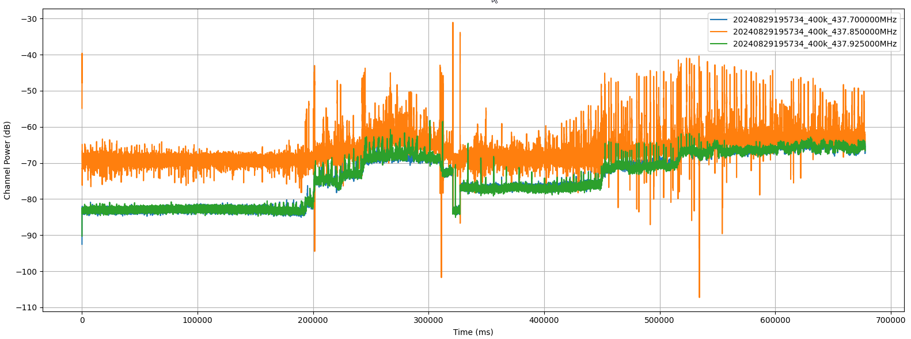
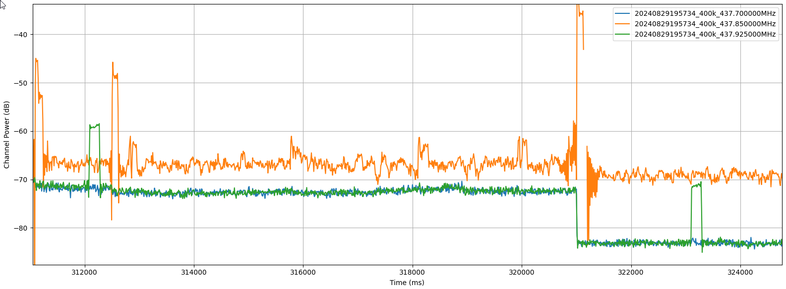
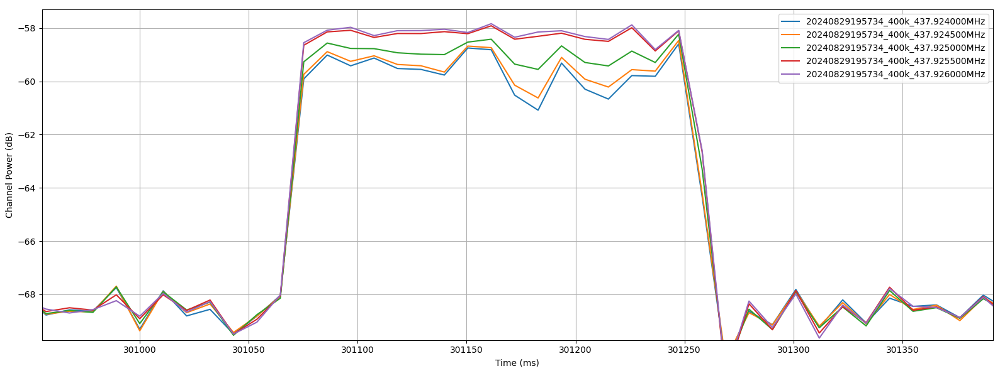
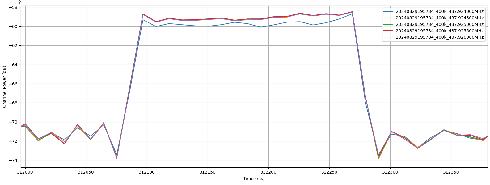
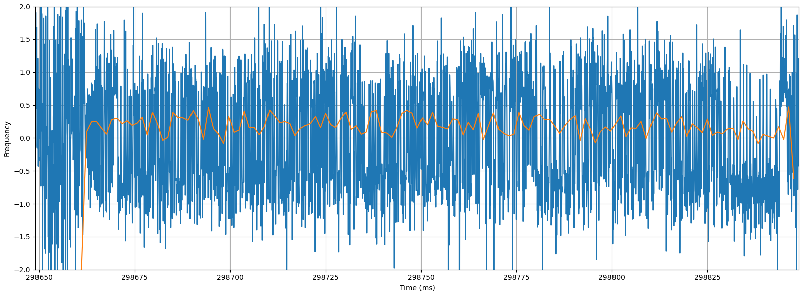
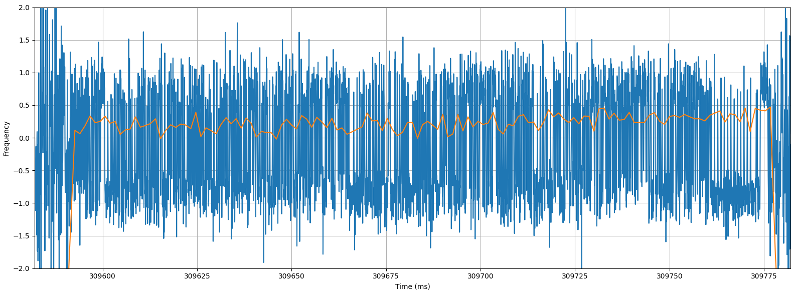

## Installation

```sh
python -m venv --upgrade-deps .venv
.venv\Scripts\activate # or "source .venv\bin\activate" on Linux
pip install -r requirements.txt
```

## Usage

### Channel Power Search

Assuming you have the IQ file from the first pass (20240829195734_400k.iq), the first step is to run channelisation and plot decimated channel power, so you can hunt for probably beacons. You can do this by running:

```sh
python binar.py 20240829195734_400k chan 437.700e6 437.850e6 437.925e6
```

This will be slow the first time you run, but almost instant each time afterwards, as it writes intermediate data to the disk for faster repeat runs. Below is an example of the plot you should get from the above command:



You can now zoom in and scroll to find probably beacons. In the above example you will find some high SNR probable beacons at 312 and 323



Having noted down the time ranges for these beacons, you check for doppler shift by plotting channel power a little bit either side of the nominal band centre:

```sh
python binar.py 20240829195734_400k chan 437.924e6 437.9245e6 437.925e6 437.9255e6 437.926e6 --offset 300 --length 20
```

The screenshots below show the maximum power for the beacon at 301000ms happens around 437.926MHz, while the beacon at 312000ms looks to be slightly lower at 437.9255MHz. If you move through the file you see a lot more variation in band centre frequency as the satellite move across the sky:





### Demodulation

You can now do focussed processing on the channelised IQ data only for those time ranges. For example:

```sh
# There is a weird error where the offset is shifted slightly compared to what was seen in the chan plot above...
python binar.py 20240829195734_400k demod 437.926e6 --offset 298.649 --length 0.2
```



```sh
python binar.py 20240829195734_400k demod 437.9255e6 --offset 309.582 --length 0.2
```



Zooming in on the start of the beacon at 298650ms, we clearly see the preamble and synchronisation headers:


### Next Steps

