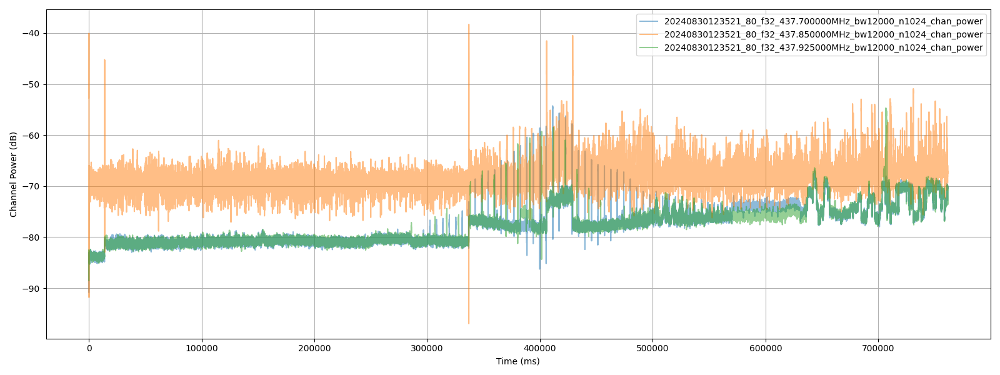

## Installation

```sh
python -m venv --upgrade-deps .venv
.venv\Scripts\activate # or "source .venv\bin\activate" on Linux
pip install -r requirements.txt
```

## Usage

Copy your .iq data files (np.complex64 raw binary data) into the top folder of your working copy of this repository. The script will find all *.iq files and attempt to process them when you first run the power command.

The ```SignalFile``` class will infer sample format, samplerate, and centre frequency from the file name according to the following rules:

1. ```{datecode}_{samplerate}.iq``` (e.g. 20240829195734_400k.iq)
2. ```{datecode}_{samplerate}_{dtype}.iq``` (e.g. 20240829195734_400k_c64.iq)
3. ```{datecode}_{samplerate}_{dtype}_{centre_freq}.iq``` (e.g. 20240902114717_192k_c64_437700000.iq)

To quickly check and rename files according to these rules, you can run:

```sh
python binar.py iq
```

If the files are all named correctly, this print the filename and parameter values, otherwise, it will prompt for missing values and offer to rename the files to include missing parameters.

**NOTES:** Rather than storing metadata in the file name, we should lock down the exact metadata that applies to IQ captures and prepend a binary struct to the start of the file...

### Channel Power Search

Assuming you have the IQ file from the first pass (20240829195734_400k.iq), the first step is to run channelisation and plot decimated channel power, so you can hunt for probably beacons. You can do this by running:

```sh
python binar.py power
```

This will be slow the first time you run (and will use around 12GB RAM), but almost instant each time afterwards, as it writes intermediate data to the disk for faster repeat runs. Below is an example of the plot you should get from the above command:



If you run with the --plot argument, you should get interactive matplotlib windows to allow you to zoom in and scroll to find probable beacons. Some possible beacon times in the various IQ data files (only the first couple are confirmed beacon transmissions):

- 20240830123521
  - python binar.py --verbose --symbolrate 9604.5 --symbol_offset 1.6 demod 20240830123521_400.0k_c64_437.85M.iq 437.700e6 --offset 405.400 --length 0.30
  - python binar.py --verbose --symbolrate 9604.5 --symbol_offset 1.6 demod 20240830123521_400.0k_c64_437.85M.iq 437.700e6 --offset 399.700 --length 0.2
  - python binar.py --verbose --symbolrate 9604.5 --symbol_offset 1.2 demod 20240830123521_400.0k_c64_437.85M.iq 437.925e6 --offset 401.150 --length 0.5
- 20240901190108:
  - python binar.py --verbose --symbolrate 9604.5 --symbol_offset 1.6 demod 20240901190108_400.0k_c64_437.85M.iq 437.700e6 --offset 771.600 --length 0.25
  - python binar.py --verbose --symbolrate 9604.5 --symbol_offset 1.6 demod 20240901190108_400.0k_c64_437.85M.iq 437.925e6 --offset 772.250 --length 0.25
- 20240902100932:
  - python binar.py --verbose --symbolrate 9604.5 --symbol_offset 1.6 demod 20240902100932_400.0k_c64_437.85M.iq 437.925e6 --offset 387.100 --length 0.25
  - python binar.py --verbose --symbolrate 9604.5 --symbol_offset 1.6 demod 20240902100932_400.0k_c64_437.85M.iq 437.700e6 --offset 387.380 --length 0.25
- 20240902114717:
  - python binar.py --verbose --symbolrate 9604.5 --symbol_offset 1.6 demod 20240902114717_400.0k_c64_437.85M.iq 437.700e6 --offset 333.500 --length 0.25
  - python binar.py --verbose --symbolrate 9604.5 --symbol_offset 1.6 demod 20240902114717_400.0k_c64_437.85M.iq 437.925e6 --offset 334.750 --length 0.25
  - python binar.py --verbose --symbolrate 9604.5 --symbol_offset 1.6 demod 20240902114717_400.0k_c64_437.85M.iq 437.700e6 --offset 339.100 --length 0.25
  - python binar.py --verbose --symbolrate 9604.5 --symbol_offset 1.6 demod 20240902114717_400.0k_c64_437.85M.iq 437.700e6 --offset 344.450 --length 0.25
  - python binar.py --verbose --symbolrate 9604.5 --symbol_offset 1.6 demod 20240902114717_400.0k_c64_437.85M.iq 437.925e6 --offset 345.250 --length 0.25

The screenshots below show the maximum power for the beacon at 301000ms happens around 437.926MHz, while the beacon at 312000ms looks to be slightly lower at 437.9255MHz. If you move through the file you see a lot more variation in band centre frequency as the satellite move across the sky:


### Demodulation

TBD 

### Next Steps

